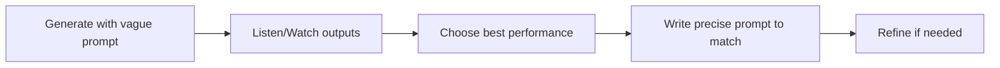

# Prompt Engineering Skill

This skill provides patterns and techniques for crafting effective prompts for AI content generation.

## Core Philosophy: Performance-First

The recommended approach is **Performance-First** (hallucination-based):



This works better than writing detailed prompts upfront because:
1. AI often produces surprising creative results
2. You can match prompt to what sounds/looks good
3. Iteration is faster than perfecting prompts blind

## Music Prompt Patterns

### Structure Tag Format (MiniMax/Suno/Udio)
```
[Genre/Style]
[Instrumentation Tags]
[Production Quality Tags]
Descriptive mood sentence
```

### Weighted Prompt Format (Lyria)
```
Primary style description, secondary element, tertiary element
```
Lyria interprets natural language; avoid square brackets.

### Effective Keywords by Genre

| Genre | Keywords |
|-------|----------|
| Jazz | walking bass, brushed drums, Rhodes piano, swing feel |
| Blues | delta, slide guitar, 12-bar, raw, vintage amplifier |
| Cinematic | orchestral, sweeping strings, timpani, film score |
| Electronic | synthesizer, 808, sidechain, drop, build-up |
| Lo-fi | vinyl crackle, dusty, tape saturation, mellow |

## Video Prompt Patterns

### Scene Description Formula
```
[Subject] [Action] [Setting]
[Lighting Condition]
[Camera Movement]
[Visual Style]
```

### Example Breakdown
```
A solitary astronaut floats in a space station     # Subject + Action + Setting
soft Earth-glow lighting, reflective visor          # Lighting
slow push-in camera movement                        # Camera
Interstellar inspired, 4K film grain               # Style
```

### Camera Keywords Cheat Sheet

| Movement | Effect |
|----------|--------|
| push-in / dolly in | Building tension |
| pull-out / dolly out | Reveal context |
| tracking / follow | Dynamic connection |
| pan / tilt | Survey scene |
| crane / jib | Dramatic scale |
| handheld | Documentary feel |
| steadicam | Smooth following |
| static / locked | Contemplative |

### Lighting Keywords

- golden hour: Warm, directional
- blue hour: Cool, moody
- rim light: Subject definition
- soft box: Studio quality
- natural: Documentary authentic
- neon: Cyberpunk aesthetic
- volumetric: Atmospheric fog/rays

## Anti-Patterns to Avoid

### ❌ Over-specification
```
# Too rigid - AI has no creative room
"Exactly 4 violins playing C major chord at 120dB"
```

### ❌ Conflicting instructions
```
# Contradictory styles
"Upbeat melancholy fast-paced relaxing track"
```

### ❌ Negative prompts (usually don't work)
```
# Avoid negatives
"No drums, no bass, no guitars"
```

### ✅ Better approach
```
# Clear positive direction
"Solo piano, minimalist, sparse arrangement, ambient"
```

## Iteration Strategy

1. **Start broad**: "Jazz piano trio"
2. **Add specifics**: "Cool jazz piano trio, late night feel"
3. **Add production**: "Cool jazz piano trio, late night, vinyl warmth, Rudy Van Gelder style"
4. **Lock winning elements**: Keep what works, vary what doesn't

## Provider-Specific Tips

### Lyria
- Shorter prompts often work better
- Temperature controls variation (higher = more creative)
- BPM is respected accurately

### MiniMax
- Structure tags [Verse], [Chorus] work well
- Reference audio URL provides style transfer
- Longer prompts with detail work fine

### Veo
- Cinematic keywords improve quality
- Aspect ratio affects composition framing
- Action verbs produce better motion

### Kling
- Highly detailed prompts work best
- Longer generations (10s) often better than 5s
- Camera movement keywords are respected
