# AI Music & Video Content Creation Guidelines

> **A Comprehensive Guide for High-Quality AI-Generated Content Production**

This document provides essential guidelines, best practices, and workflows for creating professional AI-generated music, video, and multimedia content using modern AI platforms.

> [!NOTE]
> **Model Compatibility**: The techniques in this guide apply to multiple AI music platforms including **Suno**, **Udio**, **MiniMax**, **Lyria**, and others. Platform-specific tips are noted where behavior differs.

---

## Table of Contents

1. [Philosophy: Performance-First vs Lyrics-First](#philosophy-performance-first-vs-lyrics-first)
2. [AI Music Generation Best Practices](#ai-music-generation-best-practices)
3. [Model Compatibility Guide](#model-compatibility-guide)
4. [AI Video Generation Best Practices](#ai-video-generation-best-practices)
5. [The Multi-Provider Strategy](#the-multi-provider-strategy)
6. [Production Pipeline](#production-pipeline)
7. [Tool Ecosystem](#tool-ecosystem)
8. [Prompt Engineering](#prompt-engineering)
9. [Post-Production & Mastering](#post-production--mastering)
10. [Platform-Specific Tips](#platform-specific-tips)
11. [Quick Reference](#quick-reference)

---

## Philosophy: Performance-First vs Lyrics-First

There are two fundamental approaches to AI music creation:

```mermaid
flowchart LR
    subgraph PF["✨ Performance-First (Recommended)"]
        direction TB
        P1["🎲 Generate without lyrics"]
        P2["👂 Listen & select best performance"]
        P3["✍️ Write lyrics to match"]
        P4["🎵 Final refined song"]
        P1 --> P2 --> P3 --> P4
    end
    
    subgraph LF["📝 Lyrics-First"]
        direction TB
        L1["✍️ Write complete lyrics"]
        L2["🎵 Generate music"]
        L3["🔄 Iterate & regenerate"]
        L4["🎵 Final song"]
        L1 --> L2 --> L3 --> L4
    end
    
    PF -.-> |"Faster, more natural"| OUT["High-Quality Output"]
    LF -.-> |"Better for narratives"| OUT
    
    style PF fill:#1a472a,stroke:#2d6a4f,color:#fff
    style P1 fill:#2d6a4f,stroke:#40916c,color:#fff
    style P2 fill:#2d6a4f,stroke:#40916c,color:#fff
    style P3 fill:#2d6a4f,stroke:#40916c,color:#fff
    style P4 fill:#40916c,stroke:#52b788,color:#fff
```



### Performance-First Workflow (Recommended)

> *"The performance is more important than the lyrics."* — Community Wisdom

**Works with**: Suno, Udio, MiniMax

1. **Force hallucination**: Generate songs in your target genre without providing lyrics
2. **Evaluate performances**: Listen for vocal quality, emotion, and instrumentation
3. **Write to fit**: Compose lyrics that match the syllable patterns and rhythm
4. **Benefits**:
   - Songs don't sound like "poetry set to music"
   - Fewer credits spent on iterations
   - Generates ideas you'd never consider otherwise
   - Results sound more "human-created"

### Lyrics-First Workflow

Use when you have specific narrative requirements:
1. Write complete lyrics with structure tags (`[Verse]`, `[Chorus]`, etc.)
2. Add qualifying vocal tags before each section
3. Include instrumental tags for layers
4. Iterate on performance through regeneration

---

## AI Music Generation Best Practices

> [!IMPORTANT]
> These techniques are **universal** and work across Suno, Udio, MiniMax, and similar models. The core principles of tagging, structure, and prompting are consistent across platforms.

### The Golden Rules

> 🎵 **Rule 1**: The intro and first verse are the most important parts — they set the tone for the rest of the song.

#### 1. Use Qualifying Vocal Tags
Add descriptive tags before each verse for consistent vocals:

```
[Smooth Sensual Female Vocal]
[Verse 1]
Walking through the midnight rain...

[Powerful Male Voice]
[Chorus]
We rise above the storm tonight...
```

#### 2. Layer with Instrumental Tags
Use specific instrument tags to control the arrangement:

```
[Soft Piano Intro]
[Bluesy Guitar Arpeggio]
[Smooth Bass Line]
[Subtle Drum Pattern]
[String Section Swell]
```

#### 3. Use Onomatopoeia for Complex Effects
Describe sounds phonetically:

```
[Sitar, single sustained note, shimmering with vibrato]
...eeeeeennnnnn...

[Synth, rising tension]
...whoooooOOOOOSH...
```

#### 4. Version Strategy (Suno-Specific)

> [!NOTE]
> This versioning strategy is **specific to Suno AI**. Other platforms may have different version numbers and capabilities.

| Suno Version | Strength | Best For |
|--------------|----------|----------|
| **v3.5** | Better song structures, instrumentals, stability | Full song generation |
| **v4** | Better vocals, emotional delivery | Remastering vocals |
| **v5** (Latest) | Improved coherence, experimental | Testing new capabilities |

**Workflow**: Generate full song in v3.5 for structure, then remaster in v4/v5 for vocals.

#### 5. Extension Best Practice
> ⚠️ **Always extend from the full song**, not partial sections. The model needs full context.

### Song Structure Tags

```
[Intro]           # Opening instrumental/atmospheric
[Verse]           # Main storytelling sections
[Pre-Chorus]      # Build-up to chorus
[Chorus]          # Main hook, memorable melody
[Bridge]          # Contrasting section
[Outro]           # Closing section
[Break]           # Instrumental break
[Drop]            # EDM/electronic drop section
```

### Genre-Specific Prompt Templates

#### Jazz/Blues
```
[Smooth Jazz Fusion]
[Walking Bass Line]
[Brushed Drums]
[Mellow Saxophone Solo]
[Warm Piano Chords]
```

#### Cinematic/Orchestral
```
[Epic Orchestral]
[Sweeping Strings]
[Powerful Brass Section]
[Timpani Build]
[Choir Crescendo]
```

#### Electronic/EDM
```
[Progressive House]
[Driving Bass]
[Synth Arpeggios]
[Build-up with Risers]
[Drop with Heavy Kick]
```

---

## Model Compatibility Guide

### Which Techniques Work Where?

```mermaid
flowchart TB
    subgraph CORE["🎯 Universal Techniques (All Platforms)"]
        direction LR
        C1["Structure Tags<br/>[Verse] [Chorus]"]
        C2["Mood Descriptors<br/>emotional, energetic"]
        C3["Genre Specification<br/>jazz, rock, ambient"]
        C4["Quality Keywords<br/>professional, polished"]
    end
    
    subgraph VOCAL["🎤 Vocal Platforms"]
        direction TB
        subgraph SUNO["Suno AI"]
            S1["✅ Vocal Tags"]
            S2["✅ Instrument Tags"]
            S3["✅ Version Strategy"]
            S4["✅ Hallucination"]
        end
        subgraph UDIO["Udio"]
            U1["✅ Vocal Tags"]
            U2["✅ Instrument Tags"]
            U3["⚠️ Different versions"]
            U4["✅ Hallucination"]
        end
    end
    
    subgraph INST["🎹 Instrumental Platforms"]
        direction TB
        subgraph LYRIA["Google Lyria"]
            LY1["🔶 Mood/Genre focus"]
            LY2["✅ BPM control"]
            LY3["✅ Real-time steering"]
            LY4["❌ No vocals"]
        end
        subgraph MINIMAX["MiniMax Music"]
            MM1["✅ Reference audio"]
            MM2["✅ Lyrics parameter"]
            MM3["✅ Style transfer"]
            MM4["✅ Non-English"]
        end
    end
    
    CORE --> VOCAL
    CORE --> INST
    
    style CORE fill:#2a4365,stroke:#3182ce,color:#fff
    style SUNO fill:#1a472a,stroke:#2d6a4f,color:#fff
    style UDIO fill:#1a472a,stroke:#2d6a4f,color:#fff
    style LYRIA fill:#744210,stroke:#b7791f,color:#fff
    style MINIMAX fill:#744210,stroke:#b7791f,color:#fff
```



### Platform Comparison Table

| Technique | Suno | Udio | MiniMax | Lyria | Stable Audio |
|-----------|:----:|:----:|:-------:|:-----:|:------------:|
| Vocal Tags `[Female Vocal]` | ✅ | ✅ | ✅ | ❌ | ❌ |
| Structure Tags `[Verse]` | ✅ | ✅ | ✅ | 🔶 | 🔶 |
| Instrument Tags | ✅ | ✅ | ✅ | ✅ | ✅ |
| Performance-First | ✅ | ✅ | ✅ | ✅ | ✅ |
| Reference Audio | ❌ | ❌ | ✅ | ❌ | ❌ |
| Real-time Control | ❌ | ❌ | ❌ | ✅ | ❌ |
| BPM Specification | 🔶 | 🔶 | 🔶 | ✅ | ✅ |
| Lyrics Input | ✅ | ✅ | ✅ | ❌ | ❌ |

✅ = Full support | 🔶 = Partial/prompt-based | ❌ = Not supported

### Google Gemini/Lyria Best Practices

**Lyria RealTime** uses a different approach than Suno/Udio:

```python
# Lyria uses weighted prompts, not structure tags
prompts = [
    WeightedPrompt(text="smooth jazz fusion", weight=1.0),
    WeightedPrompt(text="walking bass line", weight=0.8),
    WeightedPrompt(text="brushed drums", weight=0.6),
]

# Direct BPM and temperature control
config = LiveMusicGenerationConfig(bpm=95, temperature=0.8)
```

**What works with Lyria**:
- Genre and mood descriptors ✅
- Instrument specifications ✅
- BPM and tempo control ✅
- Real-time prompt changes ✅
- Weighted prompt mixing ✅

**What doesn't work with Lyria**:
- Vocal tags ❌
- Lyrics input ❌
- Structure tags like `[Verse]` ❌

---

## AI Video Generation Best Practices

### Video Generation Workflow

```mermaid
flowchart LR
    subgraph INPUT["📥 Input Types"]
        direction TB
        T["📝 Text Prompt"]
        I["🖼️ Image/Frame"]
        R["🎬 Reference Video"]
    end
    
    subgraph GEN["⚡ Generation"]
        direction TB
        G1["Text-to-Video"]
        G2["Image-to-Video"]
        G3["Video-to-Video"]
    end
    
    subgraph OUT["📤 Enhancement"]
        direction TB
        E["🔄 Extend/Continue"]
        M["🎨 Post-Processing"]
        F["✅ Final Video"]
    end
    
    T --> G1
    I --> G2
    R --> G3
    
    G1 --> E
    G2 --> E
    G3 --> E
    
    E --> M --> F
    
    style INPUT fill:#1e3a5f,stroke:#3182ce,color:#fff
    style GEN fill:#2d3748,stroke:#4a5568,color:#fff
    style OUT fill:#234e52,stroke:#319795,color:#fff
```



### Video Prompt Anatomy

A complete video prompt should include:

1. **Subject**: Who or what is in the scene
2. **Action**: What is happening
3. **Setting/Environment**: Where it takes place
4. **Camera Work**: Movement and angles
5. **Lighting/Mood**: Atmosphere and tone
6. **Style**: Visual aesthetic

**Example**:
```
"A majestic lion (subject) slowly walks through tall savanna grass (action),
golden hour sunlight casting long shadows (lighting), 
cinematic slow motion with a tracking dolly shot (camera),
nature documentary style, 8K resolution, shallow depth of field (style)"
```

### Camera Motion Keywords

| Motion Type | Keywords |
|-------------|----------|
| Static | locked shot, tripod, stable |
| Pan | pan left/right, sweep |
| Tilt | tilt up/down, vertical pan |
| Dolly | dolly in/out, push in, pull back |
| Tracking | follow shot, tracking shot |
| Crane | crane shot, aerial rise |
| Handheld | handheld, documentary style |
| Drone | aerial, flyover, bird's eye |

### Quality Keywords to Include

```
cinematic, high definition, 4K, 8K,
shallow depth of field, bokeh,
color graded, professional lighting,
smooth motion, fluid movement,
photorealistic, hyperrealistic
```

### Negative Prompts (What to Avoid)

```
blurry, distorted, glitchy, artifacts,
low quality, pixelated, watermark,
deformed, unnatural motion,
inconsistent lighting, flickering
```

---

## The Multi-Provider Strategy

### Why Use Multiple Providers?

```mermaid
flowchart TB
    subgraph ECOSYSTEM["🌐 AI Content Provider Ecosystem"]
        direction TB
        
        subgraph MUSIC["🎵 Music Generation"]
            direction LR
            SUNO["<b>Suno AI</b><br/>Full songs with vocals<br/>Best for: English lyrics"]
            UDIO["<b>Udio</b><br/>Full songs with vocals<br/>Best for: Alt. to Suno"]
            LYRIA["<b>Google Lyria</b><br/>Real-time instrumental<br/>Best for: Background music"]
            MINIMAX["<b>MiniMax Music</b><br/>Reference-based<br/>Best for: Style transfer"]
            STABLE["<b>Stable Audio</b><br/>Instrumental<br/>Best for: Ambient/SFX"]
        end
        
        subgraph VIDEO["🎬 Video Generation"]
            direction LR
            KLING["<b>KlingAI v2.1</b><br/>Highest quality<br/>Best for: Realism"]
            VEO["<b>Google Veo 3.1</b><br/>Fast generation<br/>Best for: Speed"]
            RUNWAY["<b>Runway Gen-4</b><br/>Creative control<br/>Best for: Effects"]
            WAN["<b>Alibaba Wan</b><br/>Consistent output<br/>Best for: Stability"]
        end
        
        subgraph IMAGE["🖼️ Image Generation"]
            direction LR
            IMAGEN["<b>Google Imagen 4</b><br/>Photorealistic"]
            FLUX["<b>Flux Pro</b><br/>Open source quality"]
            SDXL["<b>Stable Diffusion</b><br/>Local control"]
        end
        
        subgraph LLM["📝 Text/Creative"]
            direction LR
            GPT["<b>GPT-4o</b><br/>Lyrics writing"]
            CLAUDE["<b>Claude</b><br/>Creative narratives"]
            GEMINI["<b>Gemini</b><br/>Multimodal tasks"]
        end
    end
    
    style MUSIC fill:#1a472a,stroke:#2d6a4f,color:#fff
    style VIDEO fill:#2a4365,stroke:#3182ce,color:#fff
    style IMAGE fill:#5a2d82,stroke:#805ad5,color:#fff
    style LLM fill:#744210,stroke:#b7791f,color:#fff
    
    style SUNO fill:#234e52,stroke:#2f855a,color:#fff
    style UDIO fill:#234e52,stroke:#2f855a,color:#fff
    style LYRIA fill:#234e52,stroke:#2f855a,color:#fff
    style MINIMAX fill:#234e52,stroke:#2f855a,color:#fff
    style STABLE fill:#234e52,stroke:#2f855a,color:#fff
    
    style KLING fill:#2a4365,stroke:#4299e1,color:#fff
    style VEO fill:#2a4365,stroke:#4299e1,color:#fff
    style RUNWAY fill:#2a4365,stroke:#4299e1,color:#fff
    style WAN fill:#2a4365,stroke:#4299e1,color:#fff
```



### Provider Selection Guide

| Task | Primary | Fallback | Notes |
|------|---------|----------|-------|
| Full song with vocals | Suno v5 / Udio | MiniMax Music 2.0 | Suno excels at English vocals |
| Instrumental music | Lyria | Stable Audio | Real-time streaming vs batch |
| Reference-based music | MiniMax | ElevenLabs | Upload sample + describe style |
| Text-to-video | KlingAI v2.1 | Veo 3.1 | KlingAI for realism, Veo for speed |
| Image-to-video | KlingAI | Wan 2.6 | Consistent animation |
| Music video | Plazmapunk | Neural Frames | Sync audio to visuals |
| Lyrics writing | GPT-4 | Claude | Creative structure |

### Failover Strategy

```python
providers = {
    "music": ["suno-v5", "udio", "minimax-music-2.0", "lyria2"],
    "video": ["klingai/v2.1-master", "veo-3.1", "runway-gen4"],
    "image": ["imagen-4", "flux-pro", "stable-diffusion-3"]
}

async def generate_with_failover(task, providers_list):
    for provider in providers_list:
        try:
            return await generate(provider, task)
        except RateLimitError:
            continue
        except APIError as e:
            log_error(provider, e)
            continue
    raise AllProvidersFailedError(task)
```

---

## Production Pipeline

### Complete Content Creation Workflow

```mermaid
flowchart TB
    subgraph PHASE1["1️⃣ Concept Phase"]
        direction LR
        A1["💡 Define Vision"]
        A2["🔍 Research References"]
        A3["🎨 Create Mood Board"]
        A4["📋 Write Treatment"]
        A1 --> A2 --> A3 --> A4
    end
    
    subgraph PHASE2["2️⃣ Asset Generation"]
        direction TB
        B1["🎵 Generate Music"]
        B2["🖼️ Generate Images"]
        B3{"✅ Quality<br/>Check"}
        B4["💾 Save Assets"]
        B1 --> B3
        B2 --> B3
        B3 -->|Pass| B4
        B3 -->|Fail| B1
    end
    
    subgraph PHASE3["3️⃣ Video Production"]
        direction LR
        C1["🎬 Create Keyframes"]
        C2["⚡ Generate Clips"]
        C3["🔄 Extend/Refine"]
        C4["📹 Compile"]
        C1 --> C2 --> C3 --> C4
    end
    
    subgraph PHASE4["4️⃣ Post-Production"]
        direction LR
        D1["🎨 Color Grade"]
        D2["🔊 Sync Audio"]
        D3["✨ Add Effects"]
        D4["🎚️ Master"]
        D1 --> D2 --> D3 --> D4
    end
    
    subgraph PHASE5["5️⃣ Distribution"]
        direction LR
        E1["📦 Export"]
        E2["📱 Optimize"]
        E3["🚀 Publish"]
        E1 --> E2 --> E3
    end
    
    PHASE1 --> PHASE2 --> PHASE3 --> PHASE4 --> PHASE5
    
    style PHASE1 fill:#2d3748,stroke:#4a5568,color:#fff
    style PHASE2 fill:#1a472a,stroke:#2d6a4f,color:#fff
    style PHASE3 fill:#2a4365,stroke:#3182ce,color:#fff
    style PHASE4 fill:#5a2d82,stroke:#805ad5,color:#fff
    style PHASE5 fill:#744210,stroke:#b7791f,color:#fff
```



### Music-First Video Workflow

1. **Generate Music** (Suno/Udio/Lyria)
   - Create the audio track first
   - Iterate until satisfied with performance
   
2. **Analyze Music Structure**
   - Identify beats, drops, transitions
   - Mark timestamps for visual sync points
   
3. **Generate Visual Concepts**
   - Create keyframe images for each section
   - Use consistent style across images
   
4. **Create Video Segments**
   - Generate Image-to-Video for each keyframe
   - Match video mood to music section
   
5. **Sync and Edit**
   - Align video clips to music beats
   - Add transitions at natural break points

---

## Tool Ecosystem

### Free Credits Strategy

| Platform | Free Tier | Best For |
|----------|-----------|----------|
| **Suno AI** | Daily credits | Full songs with vocals |
| **Udio** | Daily credits | Alternative to Suno |
| **Kling AI** | Daily credits | Image/Text to Video |
| **HeyGen** | Monthly credits | AI avatar videos |
| **Runway** | Trial credits | Video editing/effects |
| **CapCut** | Generous free | Complete video editing |
| **Plazmapunk** | Limited free | Music video sync |

### Credit Optimization Tips

1. **Batch similar requests** to reduce overhead
2. **Test with lower quality** then upscale winners
3. **Use hallucination** to find good performances before committing
4. **Combine tools**: Generate in free tool, enhance in paid
5. **Check renewal schedules**: Daily vs monthly credits

### Recommended Tool Combinations

#### Music Video Pipeline
```
Suno/Udio (music) → Imagen (keyframes) → KlingAI (animation) → CapCut (edit)
```

#### Cinematic Short
```
GPT-4 (script) → Flux (stills) → Veo (video) → Lyria (soundtrack)
```

#### Social Content
```
Claude (concept) → Kling (video) → MiniMax (music) → CapCut (final)
```

---

## Prompt Engineering

### The Prompt Formula

```
[CONTEXT] + [SUBJECT] + [ACTION] + [STYLE] + [TECHNICAL] + [CONSTRAINTS]
```

### Music Prompt Template

```yaml
Genre: [primary genre], [secondary genre influence]
Mood: [emotional tone]
Tempo: [BPM or descriptor]
Instruments: [list key instruments]
Vocals: [voice type, style]
Structure: [song sections]
Special: [unique elements]
```

**Example**:
```
Genre: Jazz fusion, with electronic influences
Mood: Nostalgic, warm, contemplative
Tempo: 95 BPM, relaxed groove
Instruments: Fender Rhodes, upright bass, brushed drums, subtle synth pads
Vocals: Smooth female vocal, conversational delivery
Structure: Intro (8 bars), Verse, Chorus, Verse, Bridge, Chorus, Outro
Special: Vinyl crackle texture, late-night radio feel
```

### Video Prompt Template

```yaml
Scene: [description of what's happening]
Subject: [main focus]
Action: [movement/activity]
Camera: [shot type, movement]
Lighting: [light source, mood]
Style: [visual aesthetic]
Quality: [resolution, technical specs]
```

**Example**:
```
Scene: A solitary astronaut floats in a space station observation deck
Subject: Female astronaut in white suit, reflective visor
Action: Slowly reaching toward Earth through the window
Camera: Slow push-in, shallow depth of field
Lighting: Earth-glow from window, soft interior ambient
Style: Cinematic, Interstellar-inspired, emotional
Quality: 4K, film grain, anamorphic lens flares
```

---

## Post-Production & Mastering

### Audio Mastering Checklist

- [ ] **Remove shimmering artifacts** (common in AI audio)
- [ ] **Balance frequencies** with EQ
- [ ] **Compress dynamics** for consistency
- [ ] **Add subtle saturation** for warmth
- [ ] **Normalize loudness** to -14 LUFS (streaming) or -11 LUFS (YouTube)
- [ ] **Apply stereo widening** carefully
- [ ] **Limit peaks** to -1 dB

### Video Post-Processing

- [ ] **Color correction** for consistency
- [ ] **Color grading** for mood
- [ ] **Stabilization** if needed
- [ ] **Noise reduction** for cleaner image
- [ ] **Sharpening** (subtle)
- [ ] **Add film grain** for cinematic feel
- [ ] **Transitions** between clips
- [ ] **Export** in appropriate codec

### Recommended Software

| Task | Tool | Notes |
|------|------|-------|
| Audio mastering | Audacity (free), iZotope | |
| Video editing | DaVinci Resolve (free), CapCut | |
| Color grading | DaVinci Resolve | Industry standard |
| Audio sync | Any NLE | Match to waveform |

---

## Platform-Specific Tips

### Suno AI
- Use `##lyrics##` delimiters for clean lyrics parsing
- Add `[Instrumental]` tag for sections without vocals
- Extend from full song context
- Combine v3.5 structure + v4/v5 vocals

### Udio
- Similar tagging to Suno
- Different versioning system
- Strong at alternative/indie styles
- Good for non-mainstream genres

### Google Lyria (via Gemini)
- Uses weighted prompts, not structure tags
- Supports real-time BPM and mood changes
- Instrumental only (no vocals)
- Great for background/ambient music

### KlingAI
- v2.1-master produces best quality but takes 5-14 minutes
- Use effects models for special transformations
- Image-to-video gives more control than text-to-video

### MiniMax Music
- Supports reference audio for style transfer
- Use separate `prompt` (style) and `lyrics` parameters
- Great for non-English vocals

### AIML API
- Unified endpoint for multiple models
- Use `/v2/generate/audio` for all music models
- Use `/v2/video/generations` for all video models
- Polling pattern: Submit → Poll with ID → Download

---

## Quick Reference

### Music Tags Cheat Sheet

```
# Vocal Styles (Suno/Udio)
[Breathy Female Vocal] [Powerful Male Voice] [Ethereal Choir]
[Raw Emotional Delivery] [Smooth R&B Vocal] [Raspy Rock Voice]

# Instruments (All Platforms)
[Acoustic Guitar Fingerpicking] [Electric Guitar Distortion]
[Piano Ballad] [Synth Arpeggios] [Orchestral Strings]
[Funky Bass Line] [808 Sub Bass] [Live Drums]

# Song Sections (Suno/Udio)
[Intro] [Verse] [Pre-Chorus] [Chorus] [Bridge] [Outro]
[Drop] [Build-up] [Breakdown] [Hook] [Tag]

# Moods (All Platforms)
[Melancholic] [Uplifting] [Aggressive] [Dreamy]
[Nostalgic] [Euphoric] [Dark] [Playful]
```

### Video Keywords Cheat Sheet

```
# Camera
dolly, crane, handheld, gimbal, steadicam, drone
tracking, following, push in, pull back, pan, tilt

# Lighting
golden hour, blue hour, dramatic lighting, rim light
soft diffused, harsh shadows, neon, volumetric

# Style
cinematic, documentary, film noir, anime
hyperrealistic, vintage film, music video aesthetic

# Quality
8K, 4K, high frame rate, slow motion
professional, studio quality, broadcast ready
```

### API Endpoint Reference

| Service | Endpoint | Method |
|---------|----------|--------|
| AIML Music Gen | `https://api.aimlapi.com/v2/generate/audio` | POST |
| AIML Music Status | `https://api.aimlapi.com/v2/generate/audio` | GET |
| AIML Video Gen | `https://api.aimlapi.com/v2/video/generations` | POST |
| AIML Video Status | `https://api.aimlapi.com/v2/video/generations` | GET |
| KlingAI Direct | `https://api.klingai.com/v1/videos` | POST |

---

## Further Reading

### Official Documentation
- [AIML API Docs](https://docs.aimlapi.com)
- [Suno API Guide](https://suno.com/hub)
- [Udio Documentation](https://udio.com)
- [KlingAI Documentation](https://app.klingai.com/global/dev/document-api)
- [Google Veo/Imagen/Lyria](https://ai.google.dev/gemini-api/docs)

### Community Resources
- [Suno Reddit Community](https://www.reddit.com/r/SunoAI/)
- [Udio Reddit Community](https://www.reddit.com/r/udiomusic/)
- [AI Music Creation Reddit](https://www.reddit.com/r/AI_Music_Creation/)
- [Medium: Suno v5 Complete Guide](https://medium.com/@creativeaininja/suno-v5-complete-guide)

### Research
- [Nature: AI Music Generation Study](https://www.nature.com/articles/s41598-025-13064-6)
- [ArXiv: AI Content Generation](https://arxiv.org/html/2509.11824v1)

---

> 💡 **Remember**: AI tools are instruments. Your creativity, taste, and iteration are what create truly compelling content. Use these guidelines as starting points, then develop your own signature style.

---

*Last Updated: February 2026*
*Version: 2.0*
